# CS224n L6

Language Models and Recurrent Neural Networks

목차

1. Language Model 
2. RNN

# Language Model

## Language Modelling 이란

- 단어들의 나열에서 다음 단어가 뭐가 올지 맞추는 것.
- formally : sequence of words가 주어졌을 때 다음 단어로 올 단어들의 확률 분포를 계산하는것
- 이 기능을 수행하는 것을 Language Model이라 한다.
- 조건부 확률들의 곱으로 표현

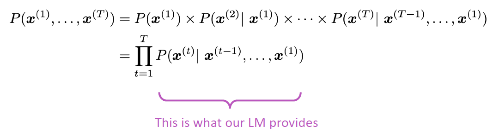

- 사용 예시  : 핸드폰의 타자 자동완성 기능, 검색어 자동 완성기능

딥러닝 이전의 language model 학습시키는 방법으로 n-gram language model이 있었다.

## N-gram Language Model이란?

정의 : n-gram은 n개 연속된 단어 뭉치이다.

아이디어 : 얼마나 n개단어뭉치가 통계적으로 같이 나오는가?

가정 : t+1번째의 x가 뭐가올지는 n-1개 앞에 있는 단어에 의해서만 결정된다고 하자.

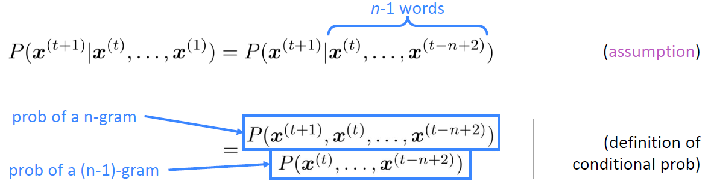

이렇게 표현할 수 있다.  n-gram과 (n-1)gram의 확률은 counting base. 학습 뭉치에 나타난 빈도수로.

예 ) 우리가 가지고 있는 학습 뭉치에 파이 라고 시작된 단어 뒤에 파이썬 파이콘 파이리 등이 있다면, 파이 가 등장한 총 횟수 분의 파이썬이 등장한 횟수를 세면 된다. 

문장이 길게 있으면, 4-gram language model을 우리가 사용한다면 앞의 모든 부분은 날아가고 우리가 맞추려고 하는 부분 바로 앞의 3단어만 조건으로 들어간다. 

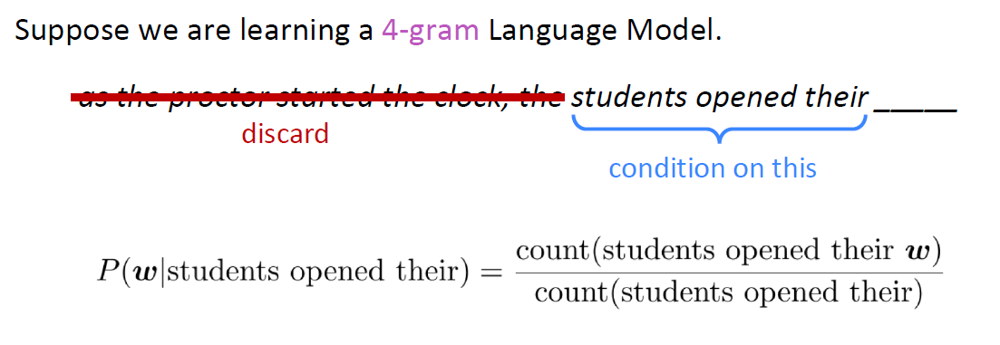

문제: 못본 단어 조합이 나오면 확률이 0으로 간주된다.

## Sparsity Problems

1. 문제 : 본 적 없는 단어의 등장은 0의 확률로 예측하는 문제점 → partial solution : add small delta to the count of 못본단어. smoothing
2. 문제 : 분모의 확률, 즉 조건부의 조건이 되는 부분이 등장한 적 없는 경우? 아예 뒤에 무슨 단어가 올지 자체를 계산을 못함 → partial solution : backoff. 예를들어 조건되는부분이 3gram이면 데이터에 존재하는 2gram을 사용한다. 

n을 키우는 것은 sparsity 문제가 점점 커짐. n을 5 이상은 잘 안쓴다.

## Storage problems

n-gram을 세기 위해 corpus에 있는 모든 n-gram을 저장해야 한다.  n을 키우는 것은 model size를 점점 키우는 꼴. 

## 실전에서의 n-gram

- 생성한 예제

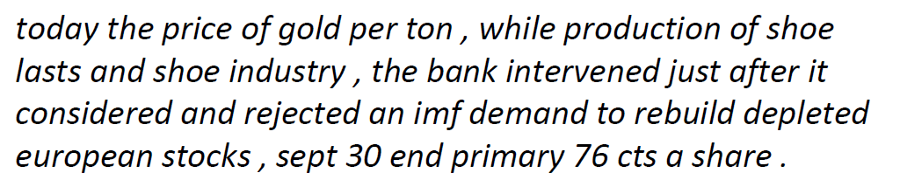

- 문법적으로 말이 되지만 내용적으로 말이 안됨. 계속 앞의 3 단어만 보고 뒤 단어를 예측하기 때문.

# Neural Language Model

window based neural model을 만드는 방법

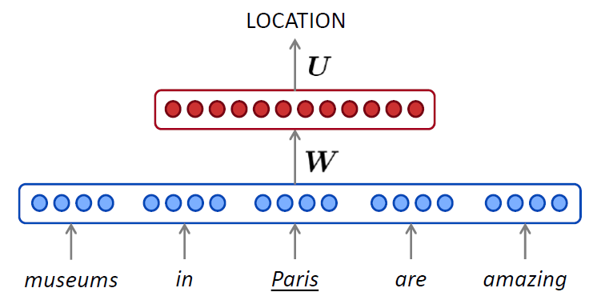

## fixed window neural language model

1. 단어들을 one-hot으로 바꾼다
2. word embedding을 한다.
3. hidden layer를 통해 nonlinearity
4. 예측하는 단어의 distribution을 출력한다. 

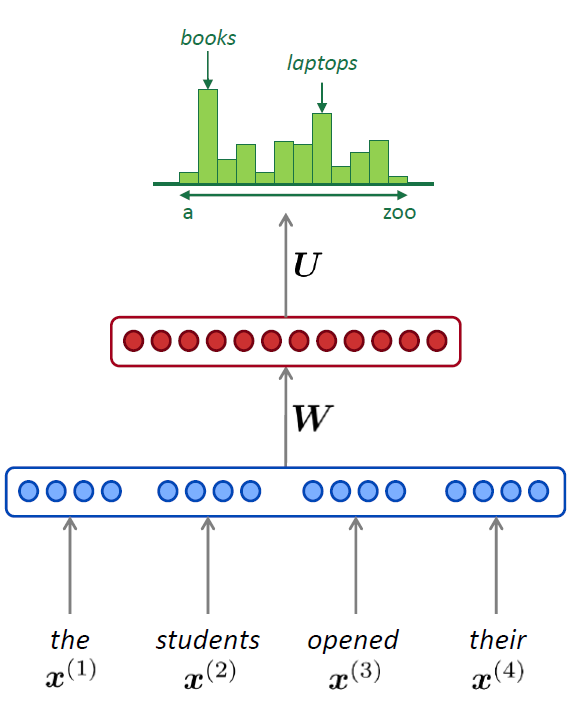

## 장점

1. sparsity문제가 사라진다. 안 본 chunk도 확률 부여 가능
2. n-gram을 전부 다 저장할 필요가 없다. (embedding)

## 해결안된 문제

1. fixed window가 너무 작다. 
2.  window크기를 키우면 W가 커진다. 
3. 문장에서 멀리있는 단어를 반영하자고 그렇다고 window를 한도없이 키울수는없다.
4. no symmetry (?)

# Recurrent Neural networks (RNN)

- neural architecture의 하나로 다음과 같은 구조를 띠고 있다.

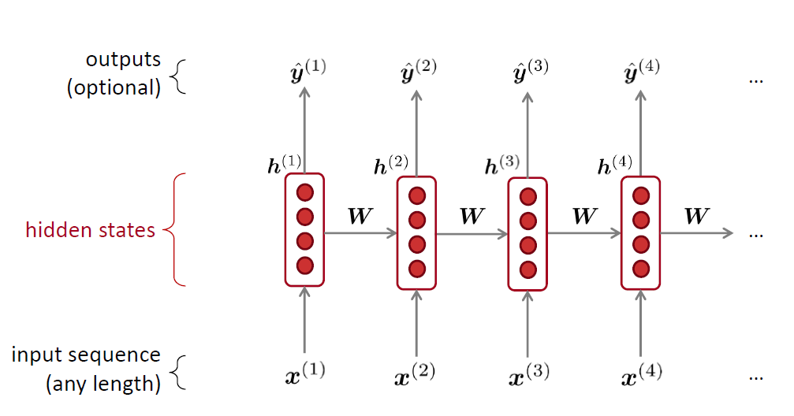

- hidden state갯수 = input 갯수
- W_h, W_e 동시학습
- embedding : pretrain사용하거나, finetuning하거나, initialize해서 새로 학습하거나.
- h0 : 아무거나. parameter / zerovec

## RNN language model

### 장점

- input length 아무거나 됨
- window size에 구애받지 않고 many steps back의 정보를 가질수 있음
- input이 커진다고 해서 model size가 커지지 않음
- same weight가 계속 쓰임. symmetry가 있음.

### 단점

- 아주느리다
- 사실은 many steps back 정보 가져오기 어렵다. (뒤에서 더 다룰 것)

그 외

- input length가 Wh에 영향을 주지는 않는다 (?)

## RNN LM을 학습시키는 방법

- corpus를 단위별로 rnn-lm에 하나씩 넣으며 timestep마다 yt를 계산한다. (모든단어의 확률분포 계산)
- Loss function
- 

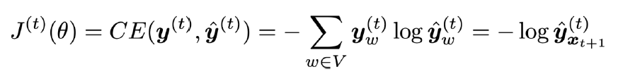

- overall Loss

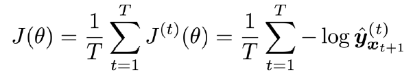

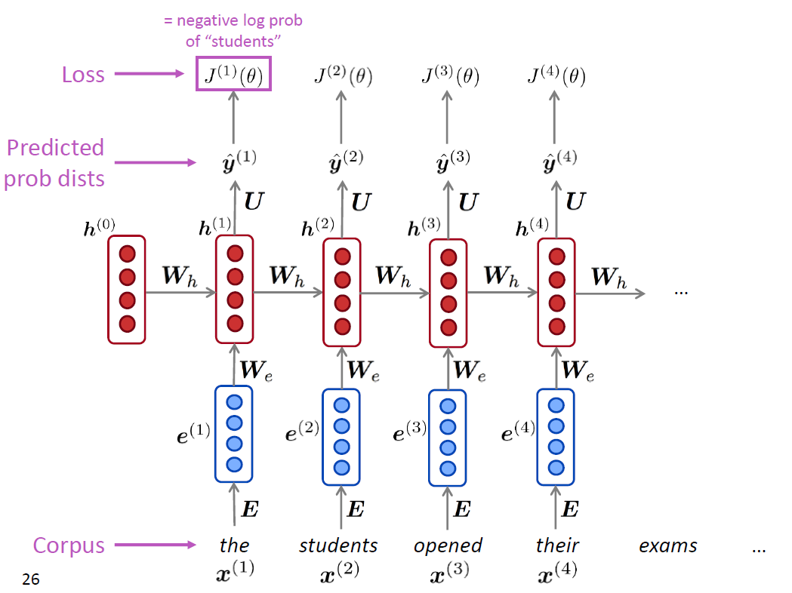

- 그러나 이렇게 전체 corpus에 대해 loss와 gradient계산하는것은 계산량이 너무 많다.
- x를 sentence단위나 document 단위로 하는 것을 한다.

## Backpropagation for RNN

- derivative of Jt(theta) w.r.t. W_h 를 다음과 같이 계산한다.

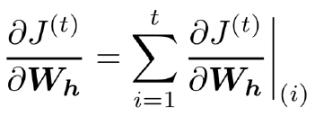

- chain rule 사용

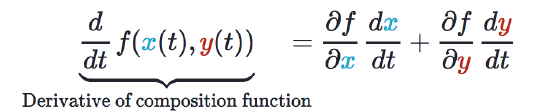

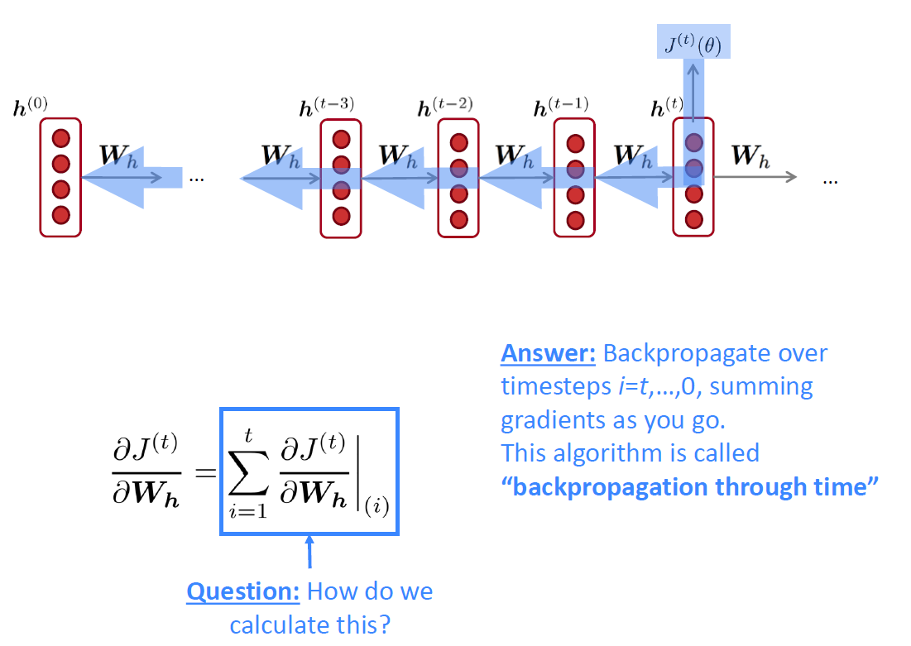

## Generating text with a RNN LM

- n-gram처럼 rnn lm도 repeated sampling으로 다음단어를 생성한다. (확률분포에서)

### 예시

- 오바마 스피치

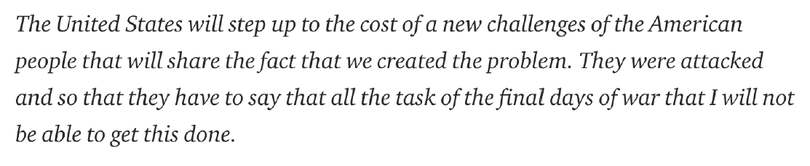

n-gram lm 보다는 훨씬 낫지만 아직도 incoherent하다

- 해리포터

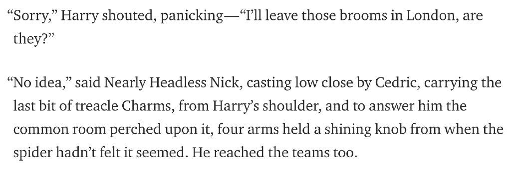

따옴표를 닫는 것도 인상적.

- 레시피

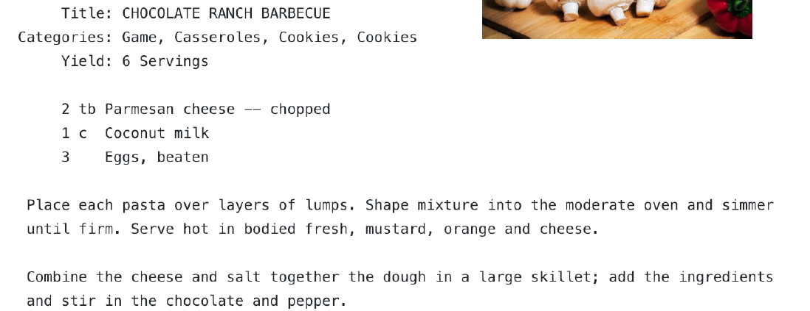

- paint color names

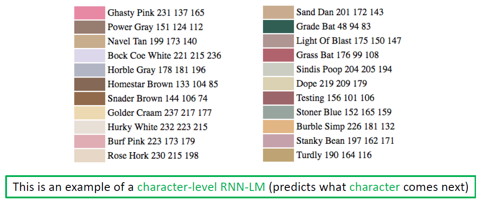

character level RNN으로 학습시킨 것이다.

## Evaluating Language Models (평가하기)

- metric : perplexity

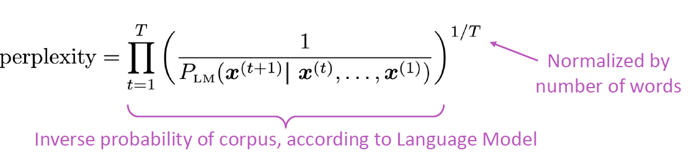

낮을수록 좋다.

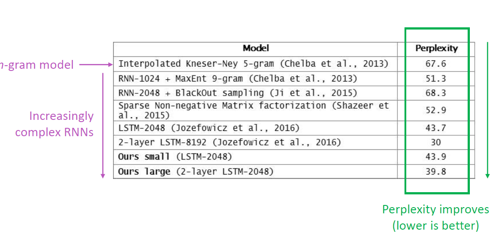

RNN LM이 n-gram LM보다 perplexity가 점점 좋아졌다.

## 우리가 Language Modelling을 신경쓰는 이유

- measure our progress on understanding language.
- 적용 분야
    - predictive typing
    - speech recognition
    - handwriting recognition
    - spelling/grammar correction
    - authorship identificiation
    - machine translation
    - summarization
    - dialogue
    - etc

### 그 외 RNN을 사용

- pos tagging
- named entity recognition
- sentence classification
- question answering