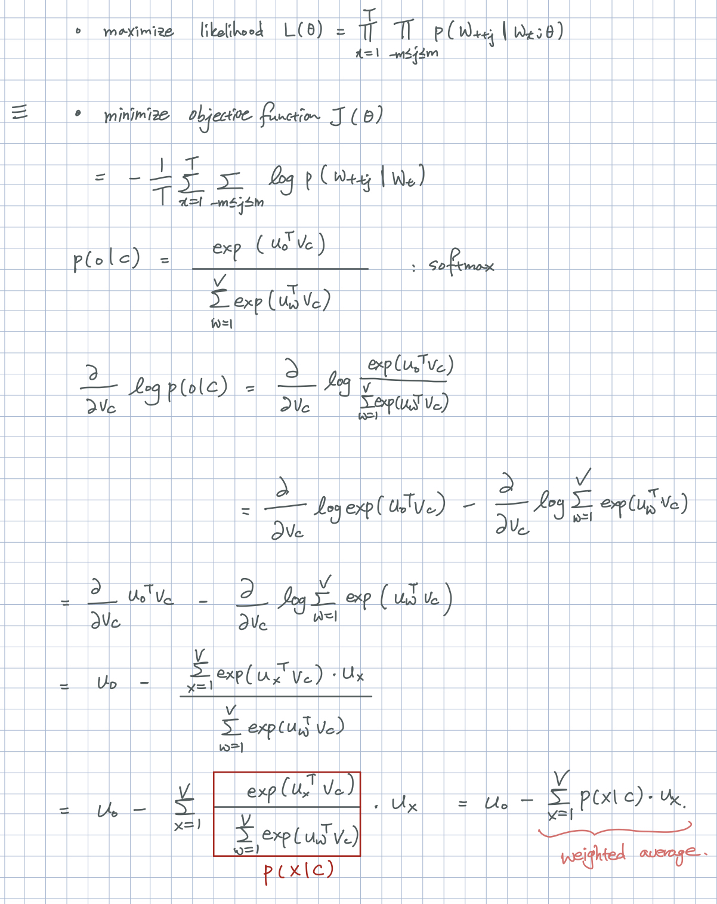

# [CS224n] Lecture 1: Introduction and Word Vectors

Standford University 의 CS224n 강의를 듣고 정리하는 글입니다.

## 1. Human Language and Word Meaning

**Word meaning** 의 뜻 : symbol → idea or thing : Denotational Semantics

우리가 '의자'라는 단어를 예로 들자면, 말하는 사람과 듣는 사람 모두 의자와 관련된 특정한 이미지와 아이디어 등을 생각해 볼 수 있다. 이렇게 단어에 대해 관념적인 것을 word meaning 이라고 할 수 있다. 그렇다면 컴퓨터에서 사용할 수 있는 **word meaning** 은 어떤 것이 있을까?

### In Computer Word Representations

1. WordNet: synonym 과 hypernyms 의 집합으로 표현 (e.g: nltk wordnet)
    - 아주 귀한 dataset 이지만,
    - 단점: Nuance (뉘앙스)를 담아내지 못함, 새로운 단어에 대해 사람이 직접 가공하여 추가해주어야 한다. 단어의 동의어에 대해 계산할 수 없음
2. Discrete Symbols: One-hot-vectors
    - 단점 : 벡터의 차원이 우리가 가지고 있는 단어의 갯수만큼 커지게 된다. Corpus 의 구성 단어가 커질 수록 계산 해야하는 벡터 차원이 매우 커진다. 이는 컴퓨팅 자원의 부족으로 인한 현실적 구현의 어려움을 야기시킨다.
    - One-hot-Vector 는 Vector Space 에서 모두 서로 orthogonal (직교)한다. 즉, similarity 가 모두 0으로 단어간의 관계를 알기 힘들다.
3. By CONTEXT: Word Vecttors
    - "You shall know a word by the company it keeps" (J.R.Firth)
    - 어떤 특정 단어 w 가 나온다는 것은, 그 주변 단어들(context)이  있기 때문이다.
    - Word Vectors == Word Embeddings == Word Representations == Distributed Representation

## 2. Word2vec Introduction

Word2vec(Mikolov et al. 2013) 은 Word Vectors 를 만들기 위한 알고리즘 중 가장 기초 뼈대를 이루는 알고리즘이다.

1. 가지고 있는 텍스트 데이터를 구성하는 큰 CORPUS
2. Corpus 의 모든 단어는 RandomVector 로 시작한다.
3. 각 position t 에 대해, 중심단어 c(center) 와 주변단어 o(outside) 를 생각할 수 있다.
4. 중심단어 c 가 주어질 때, 주변단어 o 의 확률을 구하기 위해(skip-gram)(반대로도 가능(cbow): 주변단어가 주어질 때, 중심단어의 확률을 구하는 방법), 중심단어 c 와 주변단어 o, word 벡터들에 대해 similarity를 구한다.
5. 위의 확률을 최대화 하기 위해 word vector 를 updating 한다.

## 3. Word2vec objective function gradients

문장의 특정 위치 t 에 대해 (t = 1, ..., T), 중심단어w_j가 주어졌을때, 주변단어를 한정하는 window size m 에 대해  주변단어들을 예측하는 Likelihood 는 다음과 같습니다. likelihood 식을 해석해보면, 중심단어 w_t 에 대해 중심단어를 중심으로 window 사이즈 2m 개의 단어들의 확률을 모두 곱하고, T 개의 단어 갯수에 대해 또 다시 모두 곱합니다.

$$Likelihood\quad L(\theta)= \prod_{t=1}^{T}\prod_{-m \leq j \leq m}P(w_{t+j}|w_{t};\theta)$$

목적함수는 likelihood 를 바탕으로 minimize와 average, 계산 편의를 위해 log 를 씌웠다는 것외에 likelihood 와 동일하다.

$$objective function \quad J(\theta) = - \frac{1}{T}logL(\theta)=-\frac{1}{T}\sum_{t=1}^{T}\sum_{-m \leq j \leq m, j\neq0}logP(w_{t+j} | w_{t};\theta)$$

단어가 등장할 확률을 구하는 방법은 Softmax Function 을 활용합니다.

### Objective Function 의 derivative

Objective Function 과 단어 확률 (Softmax) 의 미분을 구하는 과정이다. 

